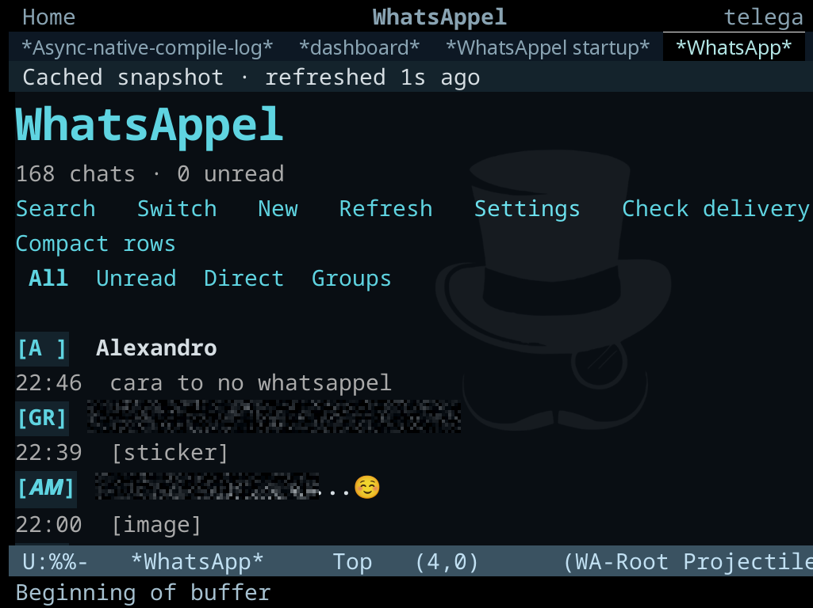
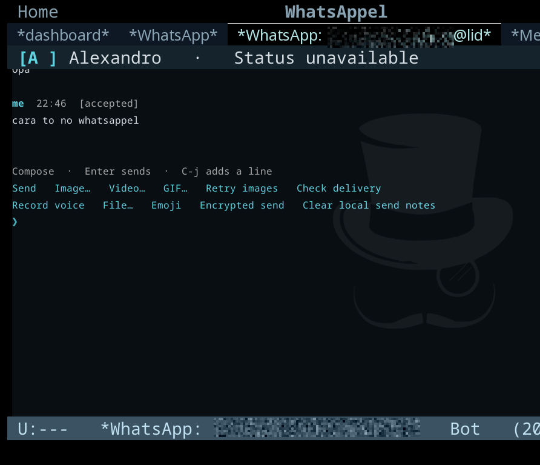
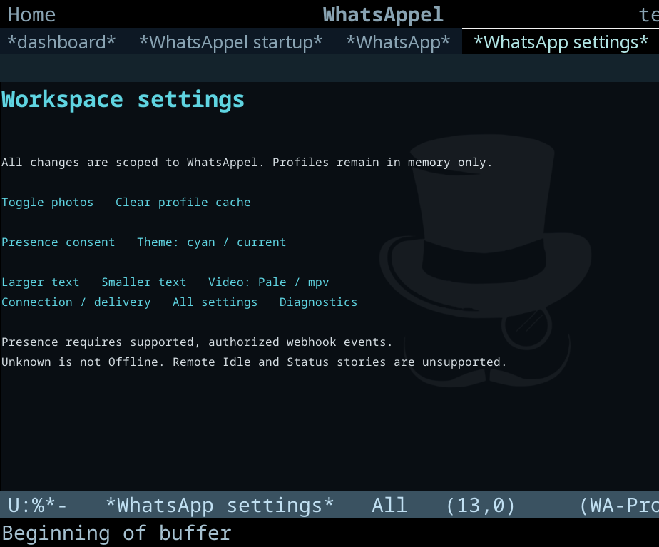
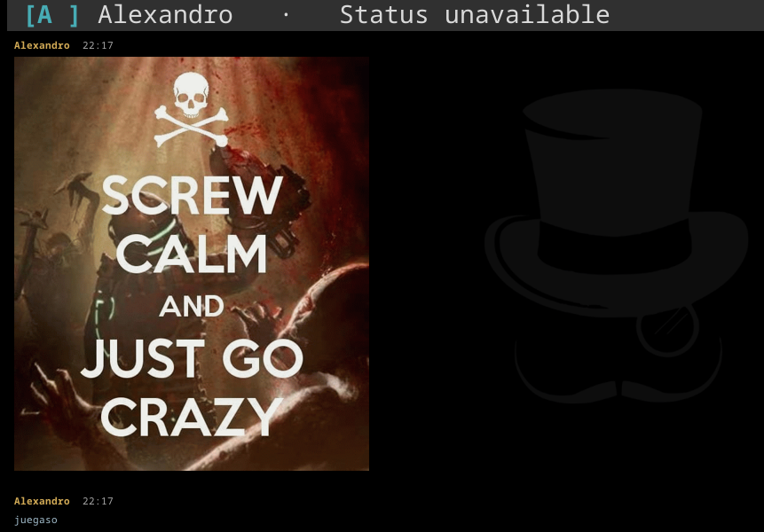
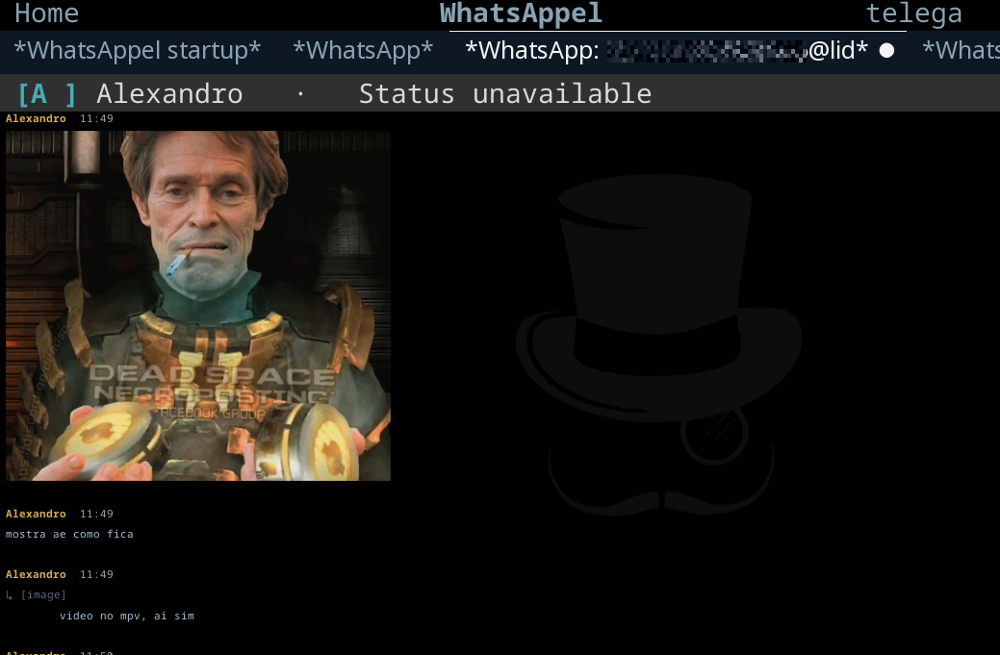

# WhatsAppel 3.3.1

Cliente WhatsApp nativo para GNU Emacs, com bridge Guile, workers Python limitados
e wuzapi/whatsmeow. Fotos de contatos, arquivamento confirmado e ferramentas nativas de conversa.

## Fotos e ferramentas de conversa

As fotos aparecem ao lado dos contatos no Emacs gráfico; o terminal mantém as
iniciais. O agendamento acompanha qualquer janela gráfica visível, inclusive
clientes de um daemon. `i` abre o contato, com foto ampliada, atualização e nova tentativa.

`a` arquiva ou restaura no WhatsApp após confirmação do provedor. `P` fixa a conversa
localmente; `m` ou o botão direito abre as ferramentas. Os filtros Inbox, Archived e
Pinned organizam as conversas. As preferências persistem em JSON privado por conta.
Mudanças de arquivamento feitas em outro dispositivo ainda não são importadas.
`M-x whatsappel` é um alias de `M-x whatsapp`.

A versão inclui as correções RC18–20. Os arquivos de distribuição usam `.zupt`:

```sh
sha256sum -c SHA256SUMS
zupt test whatsappel-3.3.1.zupt
zupt extract -o extracted whatsappel-3.3.1.zupt
cd extracted/whatsappel-3.3.1
fish scripts/update-and-activate.fish "$HOME/whatsappel" --restart-local
```

Veja [Uso](docs/USAGE.pt-BR.md) para configuração e aliases.

## Correções de confiabilidade preservadas

- Manter uma foto ainda válida no cache diante de falhas temporárias reconhecidas,
  sem prorrogar sua validade nem ignorar remoção/negação. Avatar e foto ampliada
  passam a expirar independentemente.
- Distinguir o tempo limite total nos workers de leitura, mídia e perfil; nenhuma
  falha autoriza o reenvio automático de mensagens.
- Não tratar uma consulta pendente como prova de conexão. O diagnóstico também
  recusa campos contraditórios antes de buscar uma amostra opcional de mídia.
- Preservar um recibo já observado de mensagem própria quando o histórico antigo
  informa apenas aceitação. Não inventar entrega ou leitura.
- Permitir uma conta completa selecionada pelo ambiente sem abrir um `.env` não
  relacionado; credenciais incompletas não são misturadas com as do arquivo.

[Guia de confiabilidade](docs/USAGE.pt-BR.md) ·
[English guide](docs/USAGE.md)

## Recuperação de sessão e estado real da conexão

O painel separa o estado da bridge da conexão do backend WhatsApp. O histórico
em cache não é prova de sessão conectada. **Connect existing session…** exige
confirmação, preserva as inscrições conhecidas e nunca faz logout, remove sessões
ou reenvia mensagens. Sua resposta HTTP não comprova login nem entrega.

Use **Open linking QR** quando o backend precisar de login. Registro de callback
e consentimento de presença continuam separados. O diagnóstico somente de leitura
`python3 scripts/doctor-session.py --source "$HOME/whatsappel"` informa estados
sem expor credenciais. Com `--probe-recent-image`, ele procura uma imagem recebida
recente somente após confirmar conexão e login em uma consulta atual.

[Guia de recuperação](docs/USAGE.pt-BR.md) ·
[English guide](docs/USAGE.md)

## Correções anteriores de fotos, mídia e presença

Os downloads de mídia passam pelo worker sem proxy herdado. Os perfis utilizam o
mapa LID/telefone verificado, quando já configurado. Os erros distinguem etapas,
e o painel de conexão permite registrar eventos de perfil mediante confirmação.
Visto por último histórico permanece separado da disponibilidade atual.

[Guia completo da correção](docs/USAGE.pt-BR.md) ·
[English](README.md) · [Uso](docs/USAGE.pt-BR.md)

## Atualização GNU Guix

Dentro do pacote completo de atualização, depois de verificar seu checksum:

```fish
fish scripts/update-and-activate.fish "$HOME/whatsappel" --restart-local
```

As duas auditorias nativas completas precisam passar antes da instalação. A
ativação verifica código, conta, processo e porta. `.env`, sessões, init e estado
PQ são preservados; alterações desconhecidas são recusadas. Após sucesso, salve
o trabalho e reinicie completamente o Emacs, inclusive o daemon.

## Capturas aprovadas







São as capturas anteriormente aprovadas, sem novas alterações. Não representam
validação visual do 3.3.1. O relatório de validação é distribuído separadamente.

`python3 -I scripts/audit-workspace.py . --scope full` executa a auditoria completa.
`make check` inclui as regressões nativas. Testes simulados não comprovam entrega
real, renderização em todas as máquinas ou acesso a perfis privados.

FFmpeg é necessário para miniaturas. Escolha mpv explicitamente para o player
externo. Instalar PALE não implementa seu adaptador no WhatsAppel. Aceito pelo
provedor não significa entregue; presença desconhecida não significa idle/offline.

AGPL-3.0-only. Veja [LICENSE](LICENSE) e os repositórios no README em inglês.
